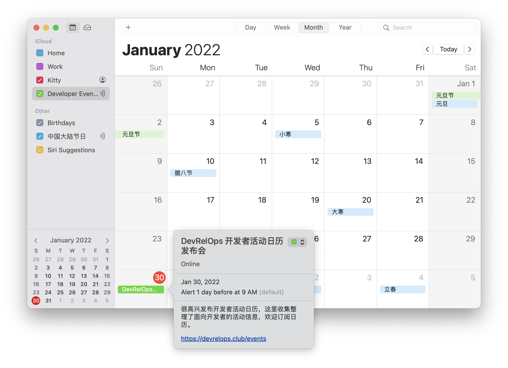

> This file was generated by [README.tpl](README.tpl) via [yaml-readme](https://github.com/LinuxSuRen/yaml-readme), please don't edit it directly!

# DevRelOps Club - 开发者关系和技术运营人社区

## 欢迎订阅日历

这些活动现在以iCalendar日历形式发布，请点击链接加入到你的日历中，就可以保持关注开发者活动的最新动态。

[订阅日历](https://devrelops.club/events.ics)

也欢迎到GitHub库里添加你的活动，我们会在这里更新活动信息。

你可以通过直接Fork代码库，在`_data/calendar/activities`目录下添加你的活动。

也可以通过提交New Event的Issue，我会转换成活动数据。



## 活动列表

目前有 11 场活动：
| 名称 | 日期 | 组织方 | 地址 |
|---|---|---|---|
| [技术大会](https://devrelops.club/events) | 2022-01-01 | 组织者 | online |
| [元旦节](https://devrelops.club) | 2022-01-01 | Name | Online |
| [DevRelOps 开发者活动日历发布会](https://devrelops.club/events) | 2022-01-30 | DevRelOps Club | Online |
| [Neo4j “图无处不在”  -  知识图谱的商业影响力](https://meeting.tencent.com/dw/XwIsWQPzNg6H) | 2022-03-09 | Neo4j中国 | online |
| [ArchSummit 全球架构师峰会](https://archsummit.infoq.cn/2022/beijing) | 2022-03-24 | InfoQ | 北京市富力万丽酒店 |
| [DIVE 全球基础软件创新大会](https://dive.infoq.cn/2022/beijing) | 2022-03-25 | InfoQ | 北京市悠唐皇冠假日酒店 |
| [PCon 全球产品创新大会](https://pcon.infoq.cn/2022/beijing) | 2022-03-25 | InfoQ | 北京市富力万丽酒店 |
| [ArchSummit 全球架构师峰会](https://archsummit.infoq.cn/2022/shanghai) | 2022-04-24 | InfoQ | 上海市宝华万豪酒店 |
| [QCon 全球软件开发大会](https://qcon.infoq.cn/2022/beijing) | 2022-05-12 | InfoQ | 北京市国际会议中心 |
| [Graph Connect 2022](https://www.graphconnect.com/) | 2022-06-06 | Neo4j | AUSTIN, TX |
| [GMTC 全球大前端技术大会](https://gmtc.infoq.cn/2022/beijing) | 2022-06-10 | InfoQ | 北京市国际会议中心 |

## 使用的组件

- [FullCalendar](https://fullcalendar.io/)

## 本地开发和测试

使用Jekyll来实现网站，托管在GitHub Pages。

启动本地服务：

```bash
nerdctl run --rm -it -v $PWD:/srv/jekyll -p 4000:4000 jekyll/jekyll jekyll serve
```

清理缓存：

```bash
rm -rf _site .jekyll-cache .jekyll-metadata
```